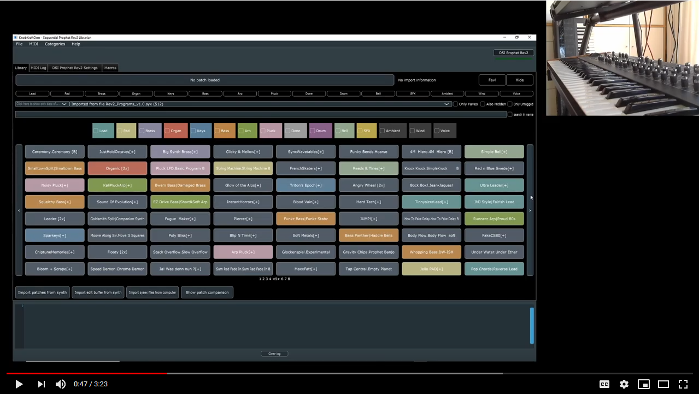

# A free MIDI Sysex Librarian - The KnobKraft Orm

If you are looking for a modern, free Sysex Librarian for your synth, you have found the right place! This is the place where the KnobKraft Orm is created, a modern cross-platform Sysex Librarian for your MIDI gear.

Currently supported synths as of version 1.1.0:

* Access Virus B
* Oberheim Matrix 1000
* Sequential/Dave Smith Instruments OB-6
* Sequential/Dave Smith Instruments Prophet Rev2
* Yamaha Reface DX

Additionally, there is a generic module that let's you hook up other MIDI gear using a bit of scripting in Python, much in the spirit of the good old SoundDiver adaptions - at least, scripting the MIDI. No custom UI currently is possible or planned.

As adaption currently available:

* Pioneer Toraiz AS-1 (untested, looking for feedback and help)

Next up under development are:

* Behringer RD-8
* Korg DW8000
* Kawai K3/K3M
* Roland MKS-80

Let me know if want a specific device to be supported, maybe I can help.

I made a video to show you the software and the most basic functionality, checkout the YouTube channel for more examples and advanced features as well:

# Downloading the software

I provide installer builds for Windows, they are hosted here in github. To install, just grab the following installer executable and run it:

[https://github.com/christofmuc/KnobKraft-orm/releases/download/1.1.0/knobkraft_orm_setup.exe](https://github.com/christofmuc/KnobKraft-orm/releases/download/1.0.0/knobkraft_orm_setup.exe)

Releases for the other platforms macOS and Linux could be provided, but as I don't have either I would be looking for help in getting these to work and uploading them here. Linux builds and runs in a virtual Debian 10, I tried that, but I haven't tested the software itself.

You can always use the source to build it yourself, please read on for more instructions.

## Supported platforms

Tested currently only on Windows 10, but all technology used is cross platform. Linux builds are part of the regular continuous integration builds, even if there is no prebuilt binary provided. Mac OS is still a future topic, looking for help!

# Building the software

## Prerequisites

We use [CMake 3.14](https://cmake.org/). Make sure to have a recent version of cmake installed. 

## Downloading

Clone with submodules from github

    git clone --recurse-submodules https://github.com/christofmuc/KnobKraft-orm

The recursive clone with  submodules is required to retrieve the following additional modules already into the right spot inside the source tree:

1. We use the magnificent [JUCE library](https://juce.com/) to immensly reduce the amount of work we have to do. 
6. [juce-cmake](https://github.com/remymuller/juce-cmake) to allow us to use JUCE and CMake together.
4. The configure step will download (on Windows) the allmighty [boost](https://www.boost.org/) library, sorry for the bloat but I simply had no time to remove the dependency yet. All my professional projects of course rely on boost, so it is a natural to incorporate it here as well.

## Building on Windows

Using CMake and building is a simple step if the prerequisites are fulfilled. Simply open a command line in the downloaded root directory `<KnobKraft-orm>` and run

    cmake -S . -B builds -G "Visual Studio 15 2017 Win64"

This will generate a solution file for Visual Studio in the builds subdirctory. You can build the software to run it immediately with the command

    cmake --build builds --config Release

This will produce the executable in the path `builds\The-Orm\Release`, namely a file called `KnobKraftOrm.exe` which you can double click and launch.

## Building on Linux

See the appveyor.yml file for some hints how the Ubuntu server is doing it. Mainly, you need to install a long list of prerequisites and development libraries:

    sudo apt-get -y update && sudo apt-get install -y libcurl4-openssl-dev pkg-config libtbb-dev libasound2-dev libboost-dev libgtk-3-dev libwebkit2gtk-4.0-dev libglew-dev libjack-dev libicu-dev libpython3-all-dev

and then can use CMake just like on Windows to compile the software:

    cmake -S . -B builds && cmake --build builds

This will produce a single executable `builds/The-Orm/KnobKraftOrm` that you can run.

## Licensing

As some substantial work has gone into the development of this, I decided to offer a dual license - AGPL, see the LICENSE.md file for the details, for everybody interested in how this works and willing to spend some time her- or himself on this, and a commercial MIT license available from me on request. Thus I can help the OpenSource community without blocking possible commercial applications.

## Contributing

All pull requests and issues welcome, I will try to get back to you as soon as I can. Due to the dual licensing please be aware that I will need to request transfer of copyright on accepting a PR. 

## About the author

Christof is a lifelong software developer having worked in various industries, and can't stop his programming hobby anyway. 
